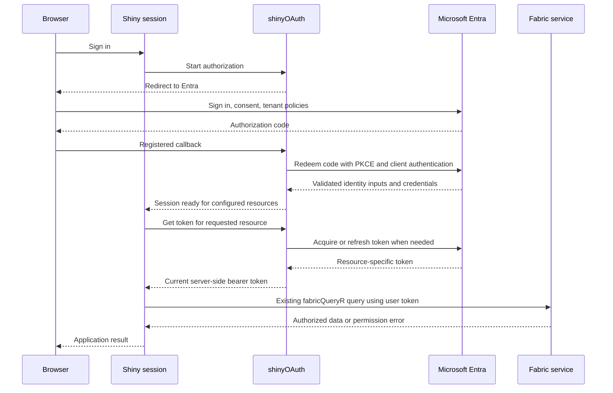

# Shiny applications using each user's Microsoft Fabric access

Design draft, 20 September 2026. No implementation in this change.

The follow-up [generic shinyOAuth proposal](shinyoauth-generic-integration-proposal.md)
refines the package boundary and staged changes described here. Prefer that
document for the proposed shinyOAuth API and implementation scope.

**Recommendation.** Add an optional, small Shiny integration to fabricQueryR,
using shinyOAuth for sign-in, identity validation, credential storage, and
refresh. Return a session interface that creates the package's existing
authenticated R6 objects and supplies an audience-aware token provider for
the functional APIs. Extend shinyOAuth with generic support for several resource
tokens under one authorization, including a Microsoft provider implementation.

The desired developer experience is: configure the Entra registration once,
add the UI wrapper and server module, obtain a Warehouse/Lakehouse/etc. object,
then use its ordinary methods. Each visitor's requests use that visitor's
delegated credentials. Fabric and the selected workload enforce access.

All `fabric_shiny_*` names and the session interface below are **proposals**.
Existing workload functions and R6 methods are identified separately. Examples
using proposed functions are design sketches, not runnable current APIs.

**1. Investigation scope and evidence**

I inspected the current local source and public exports of:

| Package | Version | Git revision |
| --- | --- | --- |
| fabricQueryR | `0.2.1.9000` | `3037cdd9d847bbc0213a295109a18ef2ed05ddb2` |
| shinyOAuth | `0.6.1.9000` | `803323c8ced957b43f5638cb11f5ccb97f3317f9` |

At the beginning of the investigation, fabricQueryR already had an unrelated
modification to `tests/testthat/test-fabric_kql_ingestion.R`. Further concurrent
source/test changes appeared during the investigation. All were left untouched;
the revisions above identify the starting snapshots, not a frozen checkout.
shinyOAuth was clean. These development interfaces should not be assumed to
exist in the current CRAN releases.

The investigation combined source inspection, relevant vignettes, focused
offline tests, and current Microsoft and Posit documentation. It did not
perform browser sign-in or call live Fabric. Platform feasibility and the
proposed integration still need the delegated-user validation described below.

**2. What fabricQueryR already provides**

The most useful building block is the existing `token` argument. It accepts a
bearer string, an AzureAuth token, or a function with this contract:

```r
function(audience, force_refresh = FALSE) {
  # Return the current bearer token for the requested service/scopes.
}
```

The function can also return a list containing `access_token` or `token`.
The callback is synchronous. A promise is not an accepted token result.
`audience` is actually a scope string or vector, including explicit delegated
scope vectors for Livy; it is not always a bare OAuth resource identifier.

Relevant behavior in [R/auth.R](../../R/auth.R):

- `fabric_credential()` is internal and adapts the supported token forms.
- `fabric_call_token_provider()` passes the requested audience and refresh flag.
- `fabric_service_credential()` reuses callback credentials across services;
  fixed tokens require explicit secondary credentials such as `storage_token`.
- Fixed credentials are bound to one resource within a credential instance.
- With `token = NULL`, AzureAuth can acquire/cache credentials and initiate
  interactive sign-in. The Shiny adapter must always supply a provider and
  must fail when the user's authorization disappears; it must never fall
  through to that default path.

[R/httr2_helpers.R](../../R/httr2_helpers.R) reads the provider on each HTTP
attempt, permits one forced refresh after a 401 when attempts remain, and
handles bounded transient retries, pagination, and redacted errors. Its 401
refresh branch is separate from the idempotency test; this matters when
describing write retry behavior. Ordinary 403 responses are not fixed by
repeatedly refreshing a token.

The existing data interfaces already cover most app needs:

| Surface | Existing functions or methods | Integration implication |
| --- | --- | --- |
| Discovery | `fabric_workspaces()`, `fabric_items()`, `fabric_item()`, typed helpers such as `fabric_warehouses()` | Return existing R6 objects with user-bound credentials. Support IDs without requiring a workspace browser. |
| SQL reads | `fabric_sql_query()`, `fabric_sql_tables()`, `fabric_sql_views()`, `fabric_sql_read_table()`; `$sql_query()`, `$sql_tables()`, `$sql_read_table()` | Natural starting point for dashboards. Query helper accepts parameters and only result-producing read statements. |
| SQL connections/writes | `fabric_sql_connect()`; `$sql_connect()`; then DBI | Small inserts/updates can use parameterized `DBI::dbExecute()` against a writable endpoint. |
| GraphQL | `fabric_graphql_query()`, `_schema()`, `_paginate()`, `_collect()`, `_cursor()`; API `$query()`, `$schema()`, `$paginate()` | Driver-free queries and supported mutations through an existing API for GraphQL item. |
| KQL/Eventhouse | `fabric_kql_query()`, `_tables()`, `_read_table()`, `_export()`; database `$query()` | Separate Kusto token; ingestion is a separate workload permission and operation. |
| Semantic models | `fabric_pbi_dax_query()`; model `$dax_query()` | Power BI token and model permissions; JSON and Arrow modes have different prerequisites. |
| OneLake files | `fabric_onelake_list()`, `_metadata()`, `_read_file()`, `_download()`, `_write_file()`, `_upload()`, `_delete()` | Storage token. Do not infer access from SQL access. |
| Table discovery/read | Lakehouse/Warehouse/Mirrored Database `_schemas()`, `_table()`, `_tables()`, `_read_table()` families | Several of these use OneLake metadata or Delta, rather than SQL; declaring only SQL access is insufficient. |
| Delta | `fabric_onelake_read_delta_table()`, `fabric_delta_config()`; `$read_delta_table()` | Python/Arrow runtime and token lifetime during a scan require additional deployment care. |
| Bulk Lakehouse writes | `fabric_lakehouse_load_table()`, `fabric_lakehouse_write_table()` | Staging plus managed load; Fabric and Storage credentials; asynchronous service operation. |
| Bulk Warehouse writes | `fabric_warehouse_write_table()` | Parquet staging and SQL load; Fabric, Storage, SQL, and source/destination permissions. |
| KQL ingestion | `fabric_kql_ingest()`, `_ingestion_status()`, `_write_table()` | Status handles, staging and cleanup; not an ordinary synchronous form insert. |
| Spark | `fabric_livy_query()`, session/batch creation, attach and listing APIs | Longer operations and broader delegated permissions; keep out of the initial dashboard path. |
| Automation | `fabric_job_*`, operation status/result/wait, `fabric_pbi_refresh*` | Can reuse authentication but should be explicit UI actions with job status. |
| Functions | `fabric_function_invoke()` | Current helper is experimental; invocation identity does not establish downstream connection identity. |
| Catalog/shortcuts | `fabric_catalog_search()`, `fabric_onelake_shortcut*`, schema/table existence helpers | Useful advanced functionality, with workload-specific permissions. |

[R/fabric_item_r6.R](../../R/fabric_item_r6.R) already propagates credentials
from workspaces to typed items and their methods. This makes a second Shiny-only
hierarchy of Warehouse, Lakehouse, and query objects unnecessary. Explicit
authentication arguments can override stored credentials in today's general
R6 interface; the integration must document that it is not a sandbox for
untrusted R code.

An especially useful existing path is `fabric_item(workspace_id, item_id)`:
when the workspace is a GUID it does not first require listing workspaces.
That preserves applications for people who have access to a particular item
without broad workspace discovery access. Supplying an already known SQL
server/database or GraphQL URL can avoid discovery entirely.

Two lifecycle limitations affect the design:

- R6 credentials are held through weak references and intentionally do not
  survive serialization. Passing a discovered object to a future/mirai worker
  does not transfer a working user credential.
- An open DBI connection has already authenticated. Clearing a provider does
  not automatically close it. A Delta scan similarly uses one token for an
  attempt; its implementation can retry an authentication failure, but does
  not replace the credential continuously during the scan.

**3. What shinyOAuth already provides**

| Existing API | Relevant capability | Boundary |
| --- | --- | --- |
| `oauth_provider_microsoft()` | Microsoft tenant selection, Entra endpoints, PKCE, nonce, ID-token validation, Microsoft signing-key rules | Defaults to Microsoft Graph UserInfo retrieval; does not configure Fabric services. |
| `oauth_client()` | Registration, redirect URI, scopes, endpoint authentication, resource settings | `resource_bases` constrains destinations; it does not mint a different token for each base. |
| `oauth_ui()`, `use_shinyOAuth()`, `oauth_module_server()` | Browser integration, callback handling, reactive authorization, refresh and logout | Single-module token state; `auth[["authenticated"]]` is a reactive value, not a function. |
| `OAuthToken` | Access/refresh tokens, expiry, scope and validated identity information | One access token; not an Entra cache covering several resources. |
| `refresh_token()` | Refresh, response validation, optional async execution | No public target-resource/scope argument; generic refresh preserves the existing granted scopes. |
| `resource_req()`, `perform_resource_req()` | Authenticated httr2 transport, including optional sender-constrained authentication | fabricQueryR has its own transport, SQL drivers and Delta runtime. |
| `oauth_connection()` | Session-bound reference to a module's current token | Does not acquire additional resource tokens or independently own refresh. |
| `OAuthConnection` methods | `request()`, `is_usable()`, `summary()`, `identity()`, managed `refresh()` | No public access-token/provider accessor for external consumers such as DBI. |
| `oauth_connections()`, `_ui()`, `_server()` | Multiple managed authorizations, owner checks, lifecycle handling, refresh coordination | Separate authorizations; current storage and owner registries support one R process. |
| `oauth_browser_owner()`, `oauth_account_owner()`, `oauth_connection_store_memory()` | Explicit retained ownership across redirects/sessions | Browser ownership is not independently verified account identity; stable keys alone do not create shared storage. |

Source evidence: [Microsoft provider](../../../shinyOAuth/R/providers.R),
[single module](../../../shinyOAuth/R/oauth_module_server.R),
[connection methods](../../../shinyOAuth/R/classes__OAuthConnection.R),
[manager](../../../shinyOAuth/R/oauth_connections.R),
[refresh implementation](../../../shinyOAuth/R/methods__token.R),
[scope narrowing](../../../shinyOAuth/R/utils__refresh_scopes.R), and the
[multiple-authorizations vignette](../../../shinyOAuth/vignettes/multiple-authorizations.Rmd).

**Four concrete gaps prevent a simple drop-in integration.**

1. **UserInfo audience.** The Microsoft preset has `userinfo_required = TRUE`
   and uses `https://graph.microsoft.com/oidc/userinfo`. A Fabric/SQL/Storage
   access token should not be sent there. Expose `userinfo_required = FALSE`
   on the preset, preserving signature, issuer, audience and nonce validation while
   disabling Graph UserInfo and its matching requirement. Microsoft explicitly
   recommends using ID-token claims when they suffice. This does not require
   Microsoft Graph `User.Read` simply to display the user's name.
   [Microsoft UserInfo guidance](https://learn.microsoft.com/en-us/entra/identity-platform/userinfo).
2. **Several resource tokens.** The current manager can hold multiple
   connections, but does not turn one Microsoft authorization into several
   access tokens. Its `refresh(scopes = ...)` narrows an existing connection;
   it is not a switch from a Fabric token to a SQL token.
3. **External token use.** Managed connections intentionally keep tokens
   private. SQL/Delta need a supported server-side adapter seam; reading R6
   private fields or copying encrypted store records is not a public API.
4. **Permission evidence.** Ordinary scope comparisons are literal set
   comparisons in `utils__scopes.R`. A Microsoft adapter must separately track
   requested consent, the target resource, granted API scopes, OIDC identity,
   and refresh availability. In particular, `.default` is not a granted
   permission string. Resource-qualified versus returned scope spellings need
   provider-specific tests, not a generic relaxation of scope checking.

**4. Authentication model**

Use a server-side Entra **Web** application registration with authorization
code flow, S256 PKCE, OIDC, and a confidential client credential. The secret
authenticates the Shiny application at the token endpoint; the resulting
resource tokens still represent the signed-in user.

An authorization request can seek consent for multiple resources; code
redemption selects one resource and returns one access token. The integration
must explicitly separate consent scopes from the scopes for each token
exchange. Use a fixed resource tenant initially; B2B visitors must sign into
the resource tenant. [Microsoft authorization code flow](https://learn.microsoft.com/en-us/entra/identity-platform/v2-oauth2-auth-code-flow).

Microsoft refresh tokens can acquire tokens for other resources where the
user/client has permission. That makes one sign-in with a managed set of
resource tokens feasible, but does not grant missing consent or bypass tenant
policy. Store and rotate the refresh credential centrally for the authorization,
with access-token entries per resource and scope set.
[Microsoft refresh tokens](https://learn.microsoft.com/en-us/entra/identity-platform/refresh-tokens).

This is delegated user access. Microsoft's specifically named **On-Behalf-Of
(OBO) flow** is a different deployment: an upstream client gives a middle-tier
API an access token issued for that API, which exchanges it for a downstream
token. A username header, ID token, or arbitrary Fabric/Graph access token is
not a substitute. Keep OBO as a later adapter for suitable hosted environments.
[Microsoft OBO flow](https://learn.microsoft.com/en-us/entra/identity-platform/v2-oauth2-on-behalf-of-flow).



The diagram is the target architecture; the multi-resource acquisition step
requires shinyOAuth work and live validation.

**5. Resources and permission selection**

The current package's audience definitions provide the routing inventory:

| Logical service | Current callback audience/scope | Permission design |
| --- | --- | --- |
| `fabric` | `https://api.fabric.microsoft.com/.default` | Resolve to the app's explicit configured Fabric scopes, such as `Workspace.Read.All` and `Item.Read.All`; narrower item scopes where appropriate. |
| `sql` | `https://database.windows.net//.default` | SQL delegated access; preserve the resource's slash convention. SQL grants determine allowed tables/actions. |
| `storage` | `https://storage.azure.com/.default` | Storage delegated access for OneLake; actual item/path permissions remain necessary. |
| `kusto` | `https://api.kusto.windows.net/.default` | Kusto delegated access and database roles. |
| `power_bi` | `https://analysis.windows.net/powerbi/api/.default` | For example `Dataset.Read.All` for DAX, separate permissions for refresh. |
| `graphql` | `https://analysis.windows.net/powerbi/api/GraphQLApi.Execute.All` | A capability within the Power BI OAuth resource; API Execute permission and source permissions/connectivity also matter. |
| `user_data_function` | `https://analysis.windows.net/powerbi/api/UserDataFunction.Execute.All` | Another capability within the Power BI resource; function Execute permission. |
| `livy` | Fabric `Lakehouse.Execute.All`, `Lakehouse.Read.All`, `Code.AccessFabric.All`, `Code.AccessStorage.All` | A scope bundle within the Fabric resource, not a new OAuth audience. |

These are current source definitions, not a claim that all are validated
through shinyOAuth today. OneLake's Storage audience and Kusto's resource are
confirmed by [OneLake authentication](https://learn.microsoft.com/en-us/fabric/onelake/onelake-access-api)
and [Kusto authentication](https://learn.microsoft.com/en-us/kusto/api/rest/authentication?view=microsoft-fabric).
The SQL and Storage delegated scope forms are also illustrated in
[Fabric data-plane authentication](https://learn.microsoft.com/en-us/fabric/workload-development-kit/fabric-data-plane).

The bridge should map known callback requests to declared resource profiles.
It must reject unknown resources and undeclared explicit scope bundles, and
must not simply append every incoming `.default` string to a login request.
Deduplicate GraphQL/DAX/functions by OAuth resource while retaining separate
permission requirements. Deduplicate Fabric discovery/Livy similarly.

Default to explicit delegated permissions for selected features. Allow a
documented static-consent `.default` mode for organizations that preconfigure
app permissions. Never mix `.default` and explicit dynamic API scopes in one
consent request. Do not report `.default` as evidence that a particular action
is permitted. [Microsoft scope and consent rules](https://learn.microsoft.com/en-us/entra/identity-platform/scopes-oidc).

A service preset is not a read/write authorization boundary. In particular,
SQL and Storage delegated access can support writes if the user has the
corresponding data permissions. There is no universal `Fabric.ReadOnly` scope.
Fabric API scopes constrain the application's delegated API access; they do
not create item access for the user.
[Fabric REST scopes](https://learn.microsoft.com/en-us/rest/api/fabric/articles/scopes).

**6. Proposed developer interface**

Keep the first public interface to four entry points:

| Proposed function | Purpose |
| --- | --- |
| `fabric_shiny_config()` | Configure Entra registration, resource profiles/scopes, redirect URI, and session policy outside `server()`. No user token at configuration time. |
| `fabric_shiny_ui(ui, id, config)` | Wrap the application UI to install browser/callback handling and a default sign-in/status/sign-out surface. |
| `fabric_shiny_server(id, config)` | Create the session interface below. |
| `fabric_shiny_token_provider(auth, resources, ...)` | Advanced integration with an already established, supported shinyOAuth authorization. Returns a callback for existing `token =` arguments. |

Keep Shiny and shinyOAuth in `Suggests`, with runtime dependency checks only
when these functions are called. Set minimum versions after the required
shinyOAuth features are released. This can live in fabricQueryR without
adding another package for developers to discover.

The module should return a small reference with:

| Member | Contract |
| --- | --- |
| `$ready(service = NULL)` | Reactive readiness for configured resources, or one service. Reports local availability, not guaranteed server permission. |
| `$identity()` | Selected validated ID-token fields: stable tenant/object or issuer/subject identity plus optional display fields. Never tokens. |
| `$status()` | Reactive, redacted service state and actionable error codes. |
| `$generation()` | Reactive identity/authorization generation; changes on logout, account replacement or consent replacement, not ordinary token refresh. |
| `$token_provider()` | Returns a synchronous `function(audience, force_refresh = FALSE)` bound to the current generation. This is a provider factory, not a raw-token getter. |
| `$workspaces(...)` | `fabric_workspaces()` using the current generation's provider. |
| `$item(workspace, item, ...)` | `fabric_item()` using the current generation's provider; same arguments and typed result. |
| `$request(path, service = "fabric", method = "GET", ...)` | Advanced authenticated HTTP escape hatch, constrained to declared service bases. See transport boundary below. |
| `$login()`, `$logout()` | Explicit local authorization lifecycle. |
| `$touch()` | Record a user action for retained-owner inactivity policy; never call automatically on background polling. |

Do not duplicate every workload function as a session method. Developers can
use item methods or pass `$token_provider()` to any supported functional API.
An optional workspace/item picker can follow later as a separate UI convenience.

Example: a Warehouse dashboard using proposed integration functions and
**existing** `$sql_query()` behavior:

```r
library(shiny)
library(fabricQueryR)

config <- fabric_shiny_config(
  tenant_id = Sys.getenv("ENTRA_TENANT_ID"),
  client_id = Sys.getenv("ENTRA_CLIENT_ID"),
  client_secret = Sys.getenv("ENTRA_CLIENT_SECRET"),
  redirect_uri = "http://localhost:8100/",
  services = c("fabric", "sql"),
  scopes = list(fabric = c("Workspace.Read.All", "Item.Read.All")),
  retention = "shiny"
)

ui <- fabric_shiny_ui(
  ui = fluidPage(
    textInput("region", "Region", "East"),
    actionButton("load", "Load orders"),
    tableOutput("orders")
  ),
  id = "fabric",
  config = config
)

server <- function(input, output, session) {
  fabric <- fabric_shiny_server("fabric", config)

  warehouse <- reactive({
    req(fabric$ready())
    fabric$item(
      workspace = Sys.getenv("FABRIC_WORKSPACE_ID"),
      item = Sys.getenv("FABRIC_WAREHOUSE_ID"),
      type = "Warehouse"
    )
  })

  orders <- eventReactive(input$load, {
    req(fabric$ready())
    fabric$touch()
    list(
      generation = fabric$generation(),
      data = warehouse()$sql_query(
        "SELECT TOP 100 order_id, region FROM dbo.orders WHERE region = ?",
        params = list(input$region),
        backend = "adbc",
        idempotent = TRUE
      )
    )
  })

  output$orders <- renderTable({
    req(fabric$ready())
    value <- orders()
    req(identical(value$generation, fabric$generation()))
    value$data
  })
}

runApp(shinyApp(ui, server), host = "127.0.0.1", port = 8100)
```

The schema is illustrative; provision the table independently. ADBC and its
SQL driver must be installed, or use the ODBC backend with its driver and the
package's documented numeric handling. This sketch shows synchronous queries.
Open the registered localhost URL; deployment uses an exact registered HTTPS
redirect, with the proxy/base-path settings described later. The root callback
avoids implying that arbitrary callback paths work without routing setup.

The generation check deliberately prevents a stored button result from being
displayed after the user changes accounts. The UI wrapper is presentation;
server-side checks and generation-bound providers enforce access.

Functional style remains available with the same integration:

```r
# Inside server-side reactive/event code, after checking readiness:
rows <- fabric_sql_query(
  server = configured_sql_server,
  database = configured_database,
  sql = "SELECT TOP 100 name FROM dbo.customers WHERE region = ?",
  params = list(input$region),
  token = fabric$token_provider()
)
```

Here `services = "sql"` can be sufficient if the endpoint is configured
directly. A fixed GraphQL endpoint can similarly use only the GraphQL profile:

```r
result <- fabric_graphql_query(
  api = configured_graphql_endpoint,
  query = configured_query_document,
  variables = list(region = input$region),
  token = fabric$token_provider()
)
```

For an app that already uses shinyOAuth, the fourth function should adapt its
supported authorization reference without adding a second login UI or making
the developer copy raw tokens. It cannot manufacture a SQL authorization from
an existing Graph-only access token. Report missing service consent clearly.

**7. Write support and useful defaults**

For small form submissions, start with the existing DBI connection path:

```r
# Proposed `fabric` session plus existing workload/DBI APIs.
# Called from an explicit Save event after validating app inputs.
save_note <- function(note) {
  req(fabric$ready("sql"))
  con <- warehouse()$sql_connect(backend = "odbc", read_only = FALSE)
  on.exit(DBI::dbDisconnect(con), add = TRUE)
  DBI::dbExecute(
    con,
    "INSERT INTO dbo.notes (note_text) VALUES (?)",
    params = list(note)
  )
}
```

The app supplies the Save button and validates its business rules. Use a
fixed destination and parameter binding; identifiers require separate quoting
or an application allowlist. The selected user must have INSERT permission.

| Write need | Recommended path | Limit |
| --- | --- | --- |
| Small inserts/edits | DBI against Fabric SQL Database or writable Warehouse endpoint | `fabric_sql_query()` itself is read-only. A Lakehouse SQL analytics endpoint cannot modify its underlying Delta data. |
| Driver-free CRUD | `fabric_graphql_query()` with a mutation document and variables | Requires an API/schema/source that exposes the mutation. |
| Upload an app-generated file | `fabric_onelake_upload()` / `fabric_onelake_write_file()` | Requires OneLake write access to the chosen path. |
| Append a batch to a Lakehouse | `fabric_lakehouse_write_table(..., mode = "Append")` | The current default is `"Overwrite"`; app examples must choose the intended mode explicitly. |
| Load a batch into a Warehouse | `fabric_warehouse_write_table(..., mode = "Append", staging_lakehouse = ...)` | More permissions and staging lifecycle than a form insert. |
| Ingest telemetry/data into Eventhouse | `fabric_kql_ingest()` / `fabric_kql_write_table()` | Ingestion completion can be delayed; expose status. |
| Execute validated business logic | `fabric_function_invoke()` | Experimental in this package; inspect function-side authorization and connection identity. |

Microsoft documents the Warehouse versus SQL analytics endpoint DML distinction
in [T-SQL surface area](https://learn.microsoft.com/en-us/fabric/data-warehouse/tsql-surface-area).
For applications dominated by row-level transactional edits, evaluate Fabric
SQL Database first; Warehouse remains appropriate when edits belong in the
existing warehouse workflow. This is an architectural recommendation, not a
guarantee about a particular application's concurrency or transaction needs.

Do not advertise bulk Warehouse writing as requiring only INSERT permission.
The current implementation stages in OneLake and loads using the SQL caller's
identity; its documented contract includes Contributor-level source and target
workspace access for this COPY route. See
[R/fabric_warehouse_tables.R](../../R/fabric_warehouse_tables.R).

Disable duplicate Save submissions while a request is in flight. Distinguish
confirmed failure from an unknown outcome after a timeout. Do not replay a
write automatically after interactive reauthentication or an ambiguous network
failure. Use a durable application operation ID where duplicate protection is
needed; a UI button flag is not durable idempotency.

A future `fabric_sql_execute()` could make small writes more convenient and
own connection cleanup, but it is not a prerequisite for Shiny integration.
Do not broaden `fabric_sql_query()` into an unrestricted execution helper.

**8. The user's identity must reach the intended authorization boundary**

Sign-in is only the first layer. The app also needs consent, user access to
the item, workload permissions, applicable tenant settings, and any data
policies at the actual execution endpoint.

- **GraphQL:** select SSO connectivity when the goal is enforcement using the
  caller's source permissions. Saved-credential connectivity authenticates to
  the source using its configured connection. The app cannot turn that into
  passthrough merely by signing in the visitor.
  [GraphQL authentication and permissions](https://learn.microsoft.com/en-us/fabric/data-engineering/connect-apps-api-graphql).
- **SQL analytics endpoints:** OneLake security now distinguishes user-identity
  and delegated-identity access modes. Their policy enforcement differs.
  Document the chosen endpoint mode; do not promise identical OneLake and SQL
  filtering from the same sign-in.
  [SQL analytics endpoint security modes](https://learn.microsoft.com/en-us/fabric/onelake/security/sql-analytics-endpoint-onelake-security).
- **Semantic models:** use the signed-in user's token, with Read/Build and the
  required tenant setting. Validate actual model roles and RLS using restricted
  users. The Execute Queries API also has response/rate limits.
  [Power BI Execute Queries](https://learn.microsoft.com/en-us/rest/api/power-bi/datasets/execute-queries).
- **User data functions:** a delegated invocation does not prove the function's
  data connections use the caller. Fabric supports managed connections and
  owner-identity generic connections. Review the function's own authorization
  model before using it for per-user write-back.
  [User data functions overview](https://learn.microsoft.com/en-us/fabric/data-engineering/user-data-functions/user-data-functions-overview).
- **Direct OneLake reads:** use OneLake permissions, rather than assuming SQL
  or semantic-model RLS is applied to a direct file/Delta read. Do not replace
  a governed query route with a direct read just because it is easier to call.

The expected UX is one "Sign in with Microsoft" action, then either the
configured app or an optional list of accessible items. Show a useful empty
state when no configured item is accessible. Separate "Sign in again",
"This action needs additional consent", and "Your account cannot access this
item". A 403 must not create an endless login loop.

**9. Responsibilities across the packages**

Put reusable authentication lifecycle behavior in shinyOAuth:

- A Microsoft provider option for validated ID-token identity without Graph
  UserInfo. Preserve the existing preset behavior by default for other users.
- A generic authorization context with one refresh-credential owner and
  resource-specific access-token entries. For Microsoft, bind it to issuer,
  tenant, client, verified user, and authorization generation. Keep provider
  protocol differences behind that reusable contract.
- Separate authorization-request scope bundles from code-redemption and
  resource-acquisition scopes. The current code exchange does not supply an
  explicit scope by default; a general `extra_token_params` override is not a
  substitute for a reviewed lifecycle API.
- An explicit provider policy for cross-resource acquisition, without changing
  ordinary OAuth refresh narrowing or SMART behavior.
- A public server-side integration method, `connection$access_token(
  required_scopes = character(), min_valid_for = 60, force_refresh = FALSE,
  async = FALSE)`, returning a bearer-token string for external libraries.
  Keep nonsecret status/expiry in `$summary()` and never expose the refresh
  credential through this method. Add `auth$connection()` to the ordinary
  `oauth_module_server()` with the same connection methods and refresh support
  as the manager's existing `auth$connection(id)`. Later resource-token support
  adds a generic named `target` argument. See the
  [focused shinyOAuth proposal](shinyoauth-generic-integration-proposal.md)
  for the proposed API and lifetime contracts.
- A generic `connection$has_scopes()` check for optional-feature UI, following
  existing scope policy without conflating token expiry with missing permission.
  Fabric item access still needs to be enforced by the service.
- An explicit module-level `auth$reauthorize()` action for recovery from an
  unusable login, with matching selected-connection behavior in the manager.
  The accessor itself should never redirect or replay the application's action.
- Serialize refresh-token use, commit rotation atomically, and discard stale
  completions after logout/account replacement. Keep identity snapshots and
  per-resource permission evidence distinct.
- Handle consent/interaction requirements as structured states, including a
  bounded path for Conditional Access claims challenges. Validate supported
  claims forwarding end-to-end before claiming seamless MFA recovery.

Put Fabric knowledge and developer conveniences in fabricQueryR:

- Resource/scope profiles and the adapter to `token(audience, force_refresh)`.
- The small Shiny config/UI/server surface and existing-item factories.
- Service-aware readiness and user-facing permission diagnostics.
- Endpoint-policy propagation through existing HTTP, SQL and Delta paths.
- Integration documentation and app examples.

The protocol supports the intended approach, but implementing it properly is
larger than wrapping `auth[["token"]]@access_token`. The first development task
should validate the acquisition contract before committing to exact public
names. Using MSAL through a supported bridge is an alternative if maintaining
Microsoft-specific token caching in R becomes too expensive; it adds runtime
and deployment dependencies and should be evaluated in that spike.

**10. Session, transport, and deployment contracts**

**Identity and object lifetime.** All user references and discovered objects
are created inside `server()`. Only immutable configuration and an owner-aware
manager/store live globally. A `$token_provider()` captures the current
authorization generation. An object created before logout cannot start making
requests under a newly selected account; obtain a new object instead. Check
ownership at each acquisition. Never key identity by mutable email alone.

**Caching.** Keep query results and discovered objects session-local by default.
Use `bindCache(..., cache = "session")` deliberately where useful, including
authorization generation and query parameters in keys. Discard old results on
logout/account replacement. Avoid global pools of connections authenticated as
different users. Shiny's default app-level cache can otherwise share results
between sessions. [Shiny caching](https://shiny.posit.co/r/articles/improve/caching/).

**Endpoint policy.** An audience-aware function only sees scopes, not the
destination URL. In today's fabricQueryR, explicit callbacks also bypass some
host protections reserved for automatically acquired AzureAuth credentials.
Therefore the new package-supplied provider must carry an endpoint policy that
`fabric_credential()` retains and each transport enforces before sending a
token. An `OAuthConnection$request()` allowlist does not protect SQL or
fabricQueryR's independent HTTP calls. Audit redirect, pagination, operation
location, discovered endpoint, SQL hostname and Delta endpoint handling.
Support documented Fabric endpoint variants; custom gateway hosts require
explicit configuration. Do not infer allowed hosts from browser inputs.

**Generic requests.** `$request()` should accept a service selector and relative
path, attach the appropriate token at execution, retain redaction and bounded
retry behavior, and return an httr2 response. Its body/query/header parameters
must not override authentication or destination. Keep unsafe write retries
off by default. Do not silently use shinyOAuth's HTTP request method for some
calls and fabricQueryR's retry behavior for others without documenting it.

**Refresh and reactivity.** Token rotation should not invalidate every expensive
query. Expose identity/generation and readiness as application dependencies;
keep token-cache updates private or isolated. Force refresh must reacquire the
relevant token and validate the result, or report a structured state. It must
not merely reread the rejected cached bearer. A provider may return the same
token string, so different bytes cannot be guaranteed. Bound any resource
request retry separately. Ordinary successful reads must not extend retained-owner
inactivity.

**Async boundary.** Initially document synchronous data calls. Async OAuth
transport does not make SQL, Delta scans or job-wait loops nonblocking. Prefetch
configured resource tokens after sign-in and refresh proactively. The callback
contract still needs a bounded synchronous acquisition path, or a clear
`refresh_pending` condition when asynchronous refresh is in progress; never
block the R event loop waiting for a promise that needs that same loop.

For later `ExtendedTask` support, resolve authorization in the owning session,
send only the required short-lived tokens plus nonsecret parameters to a
bounded worker, create DBI connections inside that worker, and discard its
result if the originating generation has ended. Do not serialize the entire
session, refresh token or credential-bearing R6 object. Long/multi-resource
tasks need an explicit renewal design. Logout cannot undo work already
accepted remotely. [Shiny nonblocking operations](https://shiny.posit.co/r/articles/improve/nonblocking).

**Connections and streams.** The first examples open a connection per operation
and close it with `on.exit()`. A future managed DBI wrapper must track and close
its connections on logout/session end. Raw connections returned to application
code remain the application's cleanup responsibility. Close streams and live
Spark sessions explicitly; never claim token refresh rewrites an established
SQL connection's identity.

**Retention.** Start with `retention = "shiny"` and one selected identity/tenant.
Browser/account retention is an explicit later option. If implementing the
fallback with several authorization redirects, browser/account retention is
needed to preserve earlier grants; the session-only manager discards them on
navigation. Current shinyOAuth retention is process-local, including owner
registries and refresh coordination. A custom state cache alone does not make
the connection manager work across workers. Limit the initial supported
deployment accordingly, and separately design shared stores/locking if needed.

**Registration and hosting.** Provide a deployment recipe for exact Web redirect
URIs, server-held client secrets or certificates, requested delegated
permissions/admin consent, HTTPS, reverse-proxy public origin/base path,
WebSocket/session routing, callback routes and cookies. Dedicated callback
paths need Shiny/proxy routing; a UI module alone cannot install an arbitrary
HTTP callback route. Reuse shinyOAuth's validated routing rather than creating
a second state/PKCE/cookie implementation.

**Logout.** Immediately disable local use and discard cached app data. Remote
revocation is best effort where supported, and local logout does not promise
global Microsoft sign-out. Do not automatically revoke unrelated grants or
perform tenant-wide sign-out. Show the selected account and provide an explicit
switch-account flow.

**11. Options considered**

| Approach | Value | Cost or limitation | Recommendation |
| --- | --- | --- | --- |
| Documentation-only single-resource callback | Quick proof using existing token/module APIs | App authors handle audience routing, lifecycle and forced refresh; not the target ergonomics | Useful spike, not the finished product. |
| Separate shinyOAuth connection per resource | Reuses existing manager and per-connection refresh | Several consent/navigation steps, retention required, same-person checks, token accessor still missing; related upstream grants may affect each other | Explicit fallback if the Microsoft broker is deferred. |
| One Microsoft authorization with resource-token management | One coherent user identity and smooth use of existing package methods | Requires shinyOAuth token-cache/acquisition additions and delegated live tests | Preferred target. |
| Add another login/refresh implementation in fabricQueryR | Full local control | Duplicates security and lifecycle responsibilities | Avoid. |
| Separate `fabricQueryR.shiny` package | Independent releases and dependencies | Another package and compatibility surface for app developers | Revisit only if integration grows substantially. |
| Hosted identity/OBO adapter | Useful for an upstream platform with suitable access tokens | Host-specific trust, consent, incoming-token validation and exchange | Later extension through the same provider contract. |

**12. Implementation plan and acceptance gates**

1. **Validate the Microsoft acquisition contract.** Create a disposable design
   prototype after approval to implement. Test one fixed tenant, an ordinary
   user, one Web registration, PKCE and validated ID-token identity. Request
   Fabric and SQL consent, redeem once, obtain both resource tokens, refresh
   each, and verify a query uses the user's permissions. Repeat with GraphQL
   and Storage as targeted follow-ups. Capture redacted scope/expiry/error
   metadata. Resolve actual Entra scope response spellings, consent behavior,
   token rotation and challenge behavior. Exit: a demonstrated contract and
   a decision on native shinyOAuth broker versus another token-cache backend.
2. **Add reusable shinyOAuth support.** Implement ID-token-only Microsoft
   profile configuration, the external token seam, resource-token management,
   owner/generation checks and single-owner refresh coordination. Preserve
   existing OAuth/SMART policies. Exit: offline lifecycle tests plus browser
   evidence for actual Entra sign-in, refresh, rejected consent and logout.
3. **Add the first fabricQueryR integration.** Implement config/UI/server and
   the adapter, preserve endpoint policies, and reuse typed discovery objects.
   Start with fixed-endpoint SQL and Fabric discovery + SQL; add GraphQL as the
   driver-free example once its resource path passes the same gates. Keep a
   single tenant/account and session retention. Exit: two simultaneous users
   see different authorized data and cannot use each other's references.
4. **Prove writes and service breadth.** Validate a small parameterized insert
   with a writer and a denied insert with a reader. Add OneLake, DAX and KQL
   profiles with separate scope/authorization evidence. Add explicit-mode bulk
   writes only after staging, expiry, completion and cleanup scenarios pass.
   Treat Livy, jobs and functions as separately tested additions.
5. **Add deployment and performance support.** Publish app-registration and
   hosting recipes, query/result lifetime guidance and a nonblocking example.
   Extend retained sessions or multiple workers only with the corresponding
   store, ownership and refresh coordination design and evidence.

Useful test cases span both packages:

| Test group | Required behavior |
| --- | --- |
| Routing | Correct resource for every existing audience; explicit Livy vectors; unknown audiences rejected; no mixing SQL/Fabric tokens. |
| Consent and scopes | Separate consent from access-token scopes; `.default` and qualified scope forms; missing consent; optional feature denied while basic access remains usable. |
| Identity isolation | Two sessions/users, two tabs, account replacement, foreign references and expired owner; no global token/data leakage. |
| Refresh | Expiry buffer, forced refresh after 401, concurrent acquisition, rotation, uncertain refresh outcome, logout during exchange, no stale commit. |
| UI lifecycle | Callback survives redirect, app subpath, sign-out, stale results hidden, 403 distinguished from reauthentication, cancelled consent. |
| Transport | Host policy survives callback adaptation; rejected custom URLs, redirects and continuation links; no bearer/refresh secrets in errors or logs. |
| SQL | Delegated read, parameter binding, reader-versus-writer grants, connection cleanup, expiry/reconnect; no ambiguous write replay. |
| Other workloads | GraphQL SSO/source permission behavior; separate OneLake access; semantic-model RLS; Kusto roles; bulk staging cleanup. |
| Background work | R6 serialization does not trigger automatic login in a worker; generation mismatch discards output; worker credentials bounded to the task. |
| Hosting | Single-process documented configuration; supported proxy/cookie/callback settings; fail clearly for unsupported retained multi-process deployment. |

Live evidence must use restricted delegated identities. The existing
service-principal Fabric sandbox suite cannot establish end-user consent,
Conditional Access, RLS, or browser session isolation. Reuse its fixtures where
appropriate, but add a dedicated delegated/browser lane. During implementation,
run focused local tests and the corresponding persistent Fabric filters before
CI; do not treat skipped integration tests as evidence.

**13. Verification completed for this investigation**

The following existing offline test groups passed, with no skipped cases
reported by the summary reporter:

```powershell
# fabricQueryR checkout
rtk proxy Rscript -e "devtools::test(filter = '^(http-auth|r6-lifecycle-credentials)$', stop_on_failure = TRUE, reporter = 'summary')"

# shinyOAuth checkout
rtk proxy Rscript -e "devtools::test(filter = '^(provider-helpers|microsoft-tenant-independent-validation|refresh-scope-narrowing|connection-identity|connection-credentials)$', stop_on_failure = TRUE, reporter = 'summary')"
```

R emitted local `LC_*` startup warnings; both corrected test invocations exited
successfully. An earlier shell-quoting attempt failed before executing tests.
These results support the existing building blocks, not the unimplemented
integration. This investigation added only this draft; it did not modify
package source, documentation exports, dependencies or live Fabric resources.

**Recommended first deliverable:** a supported sign-in plus Fabric discovery
and delegated SQL query path, returning existing R6 items and an explicit
token-provider factory. Include one small parameterized write example once
reader/writer isolation passes. Keep the resource-token design in shinyOAuth
so GraphQL, OneLake, KQL and DAX can follow through the same app interface.
